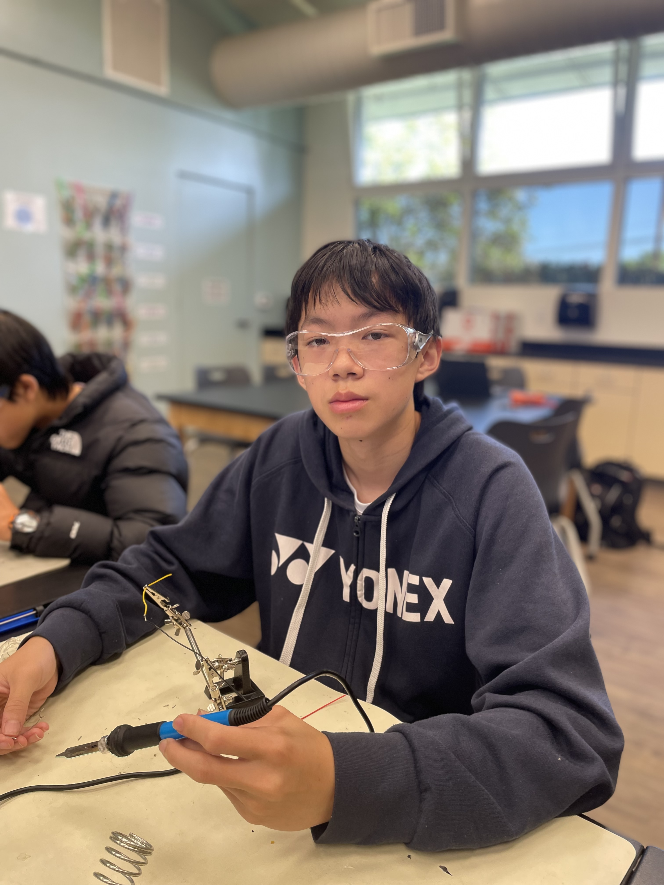

# BlueStamp Lie Detector
My project will be a close replica of a simple lie detector. It will include a GSR sensor that can check the electrical conductivity of your skin to see how much your sweating, as well as a pulseSensor that will check your hearbeat and monitor for sudden changes. These will help indicate whether a person is telling the truth; saying a lie will often cause nervousness. When the sensors detect unusual signals recieved, the buzzer will sound indicating that a lie has been told.

You should comment out all portions of your portfolio that you have not completed yet, as well as any instructions:
```HTML 
<!--- This is an HTML comment in Markdown -->
<!--- Anything between these symbols will not render on the published site -->
```

| **Engineer** | **School** | **Area of Interest** | **Grade** |
|:--:|:--:|:--:|:--:|
| Alex W | Dougherty Valley | Mechanical Engineering | Incoming Freshmen

**Replace the BlueStamp logo below with an image of yourself and your completed project. Follow the guide [here](https://tomcam.github.io/least-github-pages/adding-images-github-pages-site.html) if you need help.**



<!---# Final Milestone

**Don't forget to replace the text below with the embedding for your milestone video. Go to Youtube, click Share -> Embed, and copy and paste the code to replace what's below.**

<iframe width="560" height="315" src="https://www.youtube.com/embed/0fZ_ZQBOVEA?si=D5DX-H6xp88KZkWD" title="YouTube video player" frameborder="0" allow="accelerometer; autoplay; clipboard-write; encrypted-media; gyroscope; picture-in-picture; web-share" referrerpolicy="strict-origin-when-cross-origin" allowfullscreen></iframe>

For your final milestone, explain the outcome of your project. Key details to include are:
- What you've accomplished since your previous milestone
- What your biggest challenges and triumphs were at BSE
- A summary of key topics you learned about
- What you hope to learn in the future after everything you've learned at BSE -->


# Second Milestone (Final First Project)

<iframe width="800" height="520" src="https://www.youtube.com/embed/G-ZjnC6GVQw?si=6tOQR-NLccqIA35o" title="YouTube video player" frameborder="0" allow="accelerometer; autoplay; clipboard-write; encrypted-media; gyroscope; picture-in-picture; web-share" referrerpolicy="strict-origin-when-cross-origin" allowfullscreen></iframe>

For my second milestone, I have made a lot changes and improvements compared to my first milestone. What I first did was I made the individual codes for the pulseSensor and the gsrSensor. I learned to display readings and results in the arduino terminal window, and a major addition I made was that I added a LCD I2C screen that can display the results without having to look at the computer terminal and without the board having to be connected to the computer. Before I got to programming this though, I first had to combine the code for my gsrSensor and pulseSensor together. This was one of the major challenges of the lie detector project. I ran into an issue where the pulseSensor code would not work properly when connected with the gsrSensor, and this was because the function pulseSensor.sawStartOfBeat and pulseSensor.getBeatsPerMinute must be ran continuously in order to get accurate readings from the pulseSensor. When the gsrSensor code was added, it was put in front of the pulseSensor.getBeatsPerMinute and the 0.5~1 second delay resulted in inaccurate measurements from the pulseSensor that would go from 60 to 80 to 110 to 150 to 200. After re-ordering the code I was able to fix this issue and both sensors were able to get accurate measurements and values. I transfered displaying the results in the terminal window to the LCD screen, which is extremely satisfying to watch. One thing that did come to me as a surprise was that the lie detector doesn't actually tell lies. When I started this project, I thought that this lie detector would be 99% accurate at telling lies. It turns out, all a lie detector really does is monitor for changes in your behavior that could be an indicator for stress. In my lie detector, it monitors heartbeat and level of sweatiness to detect if a person is telling lies. When I'm telling lies, my heartbeat does not change much at all, and neither does my sweatiness level because I'm not very nervous when telling lies. Unless in an extremely important situation maybe like important job interviews these lie detectors could be more accurate as a person would be more nervous, but on normal occasions where a person tells a lie it would be extremely hard to figure out if they are lying or not. As I have made modifications to this lie detector and basically finished the entire project, my next milestone will be to start a new project, which is a waterballoon launcher on top of a car. My next milestone will also include working on my portfolio and engineering notebook. 


# First Milestone

<iframe width="800" height="520" src="https://www.youtube.com/embed/0fZ_ZQBOVEA?si=D5DX-H6xp88KZkWD" title="YouTube video player" frameborder="0" allow="accelerometer; autoplay; clipboard-write; encrypted-media; gyroscope; picture-in-picture; web-share" referrerpolicy="strict-origin-when-cross-origin" allowfullscreen></iframe>

For my first milestone, my plan is to successfully build the hardware part of the lie detector. I managed to wire all the components together, which included a buzzer, the pulseSensor, the gsrSensor, and of course the arduino uno R3 board. At first, I did have trouble understanding the wiring diagrams but I eventually learned to read these diagrams and use them to connect pieces together. I connected these through a wireless breadboard, and ran extremely simple codes to test that the wires were all connected correctly, and this also introduced me to the arduino platform of coding and libraries and simple code that would be able to provide a reading from the sensors. I did research to understand the purpose of the GSR sensor, as well as how both the sensors worked. The pulseSensor uses an led reflection from your fingers to check differences in light absorption as blood flows through your fingers. The GSR sensor measures changes in the electrical conductivity of the skin, which changes due to sweat gland activity. When people lie, they are usually nervous and this results in sweating, which can be detected by the GSR sensor. I also had a problem when trying to connect the computer arduino software to my arduino board as the USB port didn't pop up in the options. Apparently this was a problem in the privacy & security section of system settings, where it didn't allow me to connect the arduino software to the USB. My plan now is to begin to code the actual lie detector as well as continuing to learn more about coding and adding on to my project.

# Schematics 
Here's where you'll put images of your schematics. [Tinkercad](https://www.tinkercad.com/blog/official-guide-to-tinkercad-circuits) and [Fritzing](https://fritzing.org/learning/) are both great resoruces to create professional schematic diagrams, though BSE recommends Tinkercad becuase it can be done easily and for free in the browser. 


# Code

```c++
#define USE_ARDUINO_INTERRUPTS true
#include <Wire.h>
#include <LiquidCrystal_I2C.h>
#include <PulseSensorPlayground.h>

// Pin definitions
const int Pulse_Pin   = A0;
const int GSR_Pin     = A2;
const int Buzzer_Pin  = 9;
const int LED_Pin     = 13;

// Object declarations
PulseSensorPlayground pulseSensor;
LiquidCrystal_I2C lcd(0x27, 16, 2); // Use 0x3F if 0x27 doesn't work

// Calibration data
int baselineBPM = 0;
bool calibrated = false;
int gsrBaseline = 0;
int gsrThreshold = 10;

void setup() {
  Serial.begin(9600);
  pinMode(Buzzer_Pin, OUTPUT);
  pinMode(LED_Pin, OUTPUT);

  // LCD setup
  lcd.init();
  lcd.backlight();
  lcd.setCursor(0, 0);
  lcd.print("Heart Monitor");

  // PulseSensor setup
  pulseSensor.analogInput(Pulse_Pin);
  pulseSensor.setThreshold(520);
  pulseSensor.blinkOnPulse(LED_Pin);
  pulseSensor.begin();

  // === Calibrate BPM ===
  Serial.println("🔁 Calibrating BPM...");
  lcd.setCursor(0, 1);
  lcd.print("Calibrating BPM...");
  
  long totalBPM = 0;
  int count = 0;
  unsigned long startTime = millis();

  while (millis() - startTime < 5000) {
    if (pulseSensor.sawStartOfBeat()) {
      int bpm = pulseSensor.getBeatsPerMinute();
      if (bpm > 0) {
        totalBPM += bpm;
        count++;
      }
    }
    delay(20);
  }

  if (count > 0) {
    baselineBPM = totalBPM / count;
    calibrated = true;
    Serial.print("✅ Baseline BPM: ");
    Serial.println(baselineBPM);

    lcd.setCursor(0, 1);
    lcd.print("Baseline BPM:    ");
    lcd.setCursor(13, 1);
    lcd.print(baselineBPM);
  } else {
    Serial.println("❌ Could not detect heartbeat.");
    lcd.setCursor(0, 1);
    lcd.print("Calibration Fail ");
  }

  delay(1000);

  // === Calibrate GSR ===
  Serial.println("🔁 Calibrating GSR...");
  lcd.setCursor(0, 1);
  lcd.print("Calibrating GSR..");
  delay(1000);

  long gsrTotal = 0;
  for (int i = 0; i < 100; i++) {  // Reduced from 500 to 100 samples
    gsrTotal += analogRead(GSR_Pin);
    delay(2); // 2ms × 100 = ~200ms
  }
  gsrBaseline = gsrTotal / 100;
  Serial.print("Baseline GSR: ");
  Serial.println(gsrBaseline);

  lcd.setCursor(0, 1);
  lcd.print("Baseline GSR:    ");
  lcd.setCursor(13, 1);
  lcd.print(gsrBaseline);

  delay(1000);
  lcd.clear();
}

void loop() {
  if (!calibrated) return;

  // === BPM Reading ===
  if (pulseSensor.sawStartOfBeat()) {
    int bpm = pulseSensor.getBeatsPerMinute();

      // === GSR Reading (non-blocking sample) ===
    long gsrSum = 0;
    for (int i = 0; i < 50; i++) {  // Reduced from 500 to 50 samples
      gsrSum += analogRead(GSR_Pin);
      delay(2); // 2ms × 50 = ~100ms
    }
    int gsrAvg = gsrSum / 50;
    int gsrDiff = gsrAvg - gsrBaseline;
    Serial.print("BPM: ");
    Serial.print(bpm);
    Serial.print(" | GSR: ");
    Serial.print(gsrAvg);
    Serial.print(" | ΔGSR: ");
    Serial.println(gsrDiff);

    // === Top Row: BPM + GSR ===
    lcd.setCursor(0, 0);
    lcd.print("BPM:");
    lcd.print(bpm);
    lcd.print(" GSR:");
    lcd.print(gsrAvg);
    lcd.print("   "); // clear trailing chars

    // === Bottom Row: Stress Detection ===
    lcd.setCursor(0, 1);
    if (bpm > baselineBPM + 10 || abs(gsrDiff) > gsrThreshold) {
      lcd.print("Status: Stress!     ");
      tone(Buzzer_Pin, 1000);
      delay(200);
      noTone(Buzzer_Pin);
    } else {
      lcd.print("Status: Normal      ");
      noTone(Buzzer_Pin);
    }
  }

  delay(20);
}
```

# Bill of Materials
<table>
  <thead>
    <tr>
      <th>Part</th>
      <th>Note</th>
      <th>Price</th>
      <th>Link</th>
    </tr>
  </thead>
  <tbody>
    <tr>
      <td>GSR Sensor</td>
      <td>uses electrical conductivity to detect how much sweat a person is producing</td>
      <td>$35.20</td>
      <td><a href="https://a.co/d/iC6IGyz">Link</a></td>
    </tr>
    <tr>
      <td>PulseSensor</td>
      <td>uses led light reflection to check the heartbeat of a person</td>
      <td>$24.99</td>
      <td><a href="https://a.co/d/2g7Ixup">Link</a></td>
    </tr>
    <tr>
      <td>Arduino Super Starter Kit Uno R3</td>
      <td>basic starter kit needed for any simple arduino project</td>
      <td>$44.99</td>
      <td><a href="https://a.co/d/iC6IGyz">Link</a></td>
    </tr>
  </tbody>
</table>

# Starter Project

<iframe width="560" height="315" src="https://www.youtube.com/embed/yE2564JcbFw?si=SatDaVpdTPBzAajv" title="YouTube video player" frameborder="0" allow="accelerometer; autoplay; clipboard-write; encrypted-media; gyroscope; picture-in-picture; web-share" referrerpolicy="strict-origin-when-cross-origin" allowfullscreen></iframe>

For my starter project, I built a Retro Arcade Console. I chose this project because the project included soldering iron into the chip and connecting it with other parts as well as using nuts and screws to build it. It seems pretty complicated and I saw it as a great way to learn and explore more. In the end, I completed the build and created a working gaming console with display screens, a scoreboard, and 6 buttons used to play various games. It also includes a buzzer and can be powered on with both a USB and batteries. Some challenges I faced while building this was that my soldering pen didn't work, so that I had to use my neighbor's. Although this caused a slight delay in my progress, I ultimately finished this project. My next goal is to start my intensive project and build the physical componment by the next milestone.


# Other Resources/Examples
One of the best parts about Github is that you can view how other people set up their own work. Here are some past BSE portfolios that are awesome examples. You can view how they set up their portfolio, and you can view their index.md files to understand how they implemented different portfolio components.
- [Example 1](https://trashytuber.github.io/YimingJiaBlueStamp/)
- [Example 2](https://sviatil0.github.io/Sviatoslav_BSE/)
- [Example 3](https://arneshkumar.github.io/arneshbluestamp/)

To watch the BSE tutorial on how to create a portfolio, click here.
